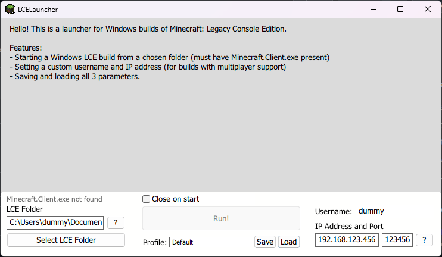

# LCELauncher
A simple launcher for Windows LCE builds made in Clickteam Fusion.
Features:
- Starting a Windows LCE build from a chosen folder (must have Minecraft.Client.exe present)
- Setting a custom username, IP address and ports (the latter 2 for builds with multiplayer support)
- Saving and loading all 4 parameters in separate presets.

